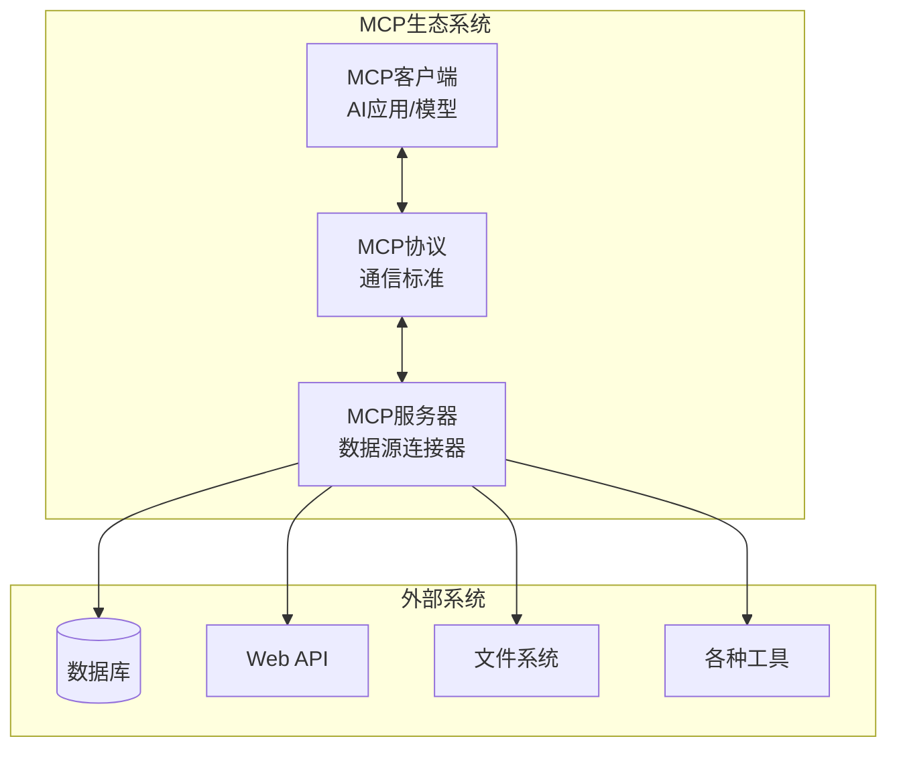

# MCP协议概述：连接AI与世界的标准

> Model Context Protocol - 让AI应用安全、便捷地访问任何数据源

## 🌟 什么是MCP？

MCP（Model Context Protocol）是Anthropic推出的开源标准协议，旨在解决AI应用与外部数据源之间的连接问题。它为AI模型提供了一个安全、标准化的方式来访问和操作各种数据源和工具。

> **"导师，我经常听到MCP这个词，但不太明白它到底是什么？"**小明困惑地问道。
> 
> **"哈哈，小明，MCP就像是AI世界的万能转接头！"**我笑着回答，**"想象一下，如果AI是个超级聪明的助手，但它被困在一个房间里，MCP就是让它能够安全地走出房间，去图书馆、银行、商店获取信息和服务的通行证。"**

## 🎯 为什么需要MCP？

### 传统方式的问题 ❌

在MCP出现之前，AI应用连接外部系统面临诸多挑战：

```python
# 传统方式：每个应用都需要自己的连接器
class TraditionalConnector:
    def connect_to_database(self):
        # 自定义数据库连接逻辑
        pass
    
    def connect_to_api(self):
        # 自定义API连接逻辑
        pass
    
    def handle_authentication(self):
        # 自定义认证逻辑
        pass
    
    def manage_security(self):
        # 自定义安全逻辑
        pass
```

**痛点**：
- 🔧 **重复开发**：每个AI应用都要重新实现连接逻辑
- 🔒 **安全风险**：缺乏统一的安全标准
- 🤝 **兼容性差**：不同系统间难以互操作
- 📈 **维护困难**：连接器代码分散，难以统一维护

### MCP的解决方案 ✅

MCP通过标准化协议解决了这些问题：

```typescript
// MCP方式：标准化的连接协议
interface MCPServer {
    name: string;
    version: string;
    tools: Tool[];
    resources: Resource[];
}

interface MCPConnection {
    connect(): Promise<void>;
    listTools(): Promise<Tool[]>;
    callTool(name: string, args: any): Promise<any>;
    getResource(uri: string): Promise<Resource>;
}
```

**优势**：
- 🔧 **标准统一**：所有连接都遵循同一协议
- 🔒 **安全可控**：内置安全机制和权限管理
- 🤝 **即插即用**：一次开发，处处使用
- 📈 **易于扩展**：模块化设计，支持热插拔

## 🏗️ MCP架构设计

### 核心组件

MCP采用客户端-服务器架构，主要包含三个核心组件：



#### 1. MCP客户端 🖥️
- **作用**：AI应用或模型，发起数据请求
- **功能**：解析协议、管理连接、处理响应
- **示例**：Claude Desktop、自定义AI应用

#### 2. MCP服务器 🔧
- **作用**：连接具体的数据源或工具
- **功能**：提供标准接口、处理请求、返回数据
- **示例**：数据库连接器、文件系统访问器

#### 3. MCP协议 📡
- **作用**：定义通信标准和数据格式
- **功能**：确保兼容性、保障安全性
- **特点**：基于JSON-RPC 2.0，支持双向通信

## 🔑 核心概念

### 1. 工具（Tools）

工具是MCP服务器可以执行的操作：

```json
{
  "name": "search_database",
  "description": "在数据库中搜索记录",
  "inputSchema": {
    "type": "object",
    "properties": {
      "query": {
        "type": "string",
        "description": "搜索查询语句"
      },
      "table": {
        "type": "string", 
        "description": "要搜索的表名"
      }
    },
    "required": ["query"]
  }
}
```

### 2. 资源（Resources）

资源是MCP服务器可以提供的数据：

```json
{
  "uri": "file://documents/report.pdf",
  "name": "月度报告",
  "mimeType": "application/pdf",
  "description": "2024年3月业务报告"
}
```

### 3. 提示（Prompts）

提示是预定义的AI交互模板：

```json
{
  "name": "analyze_data",
  "description": "分析业务数据",
  "arguments": [
    {
      "name": "dataset",
      "description": "要分析的数据集",
      "required": true
    }
  ]
}
```

## 🚀 实际应用示例

### 示例1：连接数据库

```python
# MCP服务器：数据库连接器
class DatabaseMCPServer:
    def __init__(self, db_url):
        self.db = connect_database(db_url)
        
    async def list_tools(self):
        return [
            {
                "name": "query_customers",
                "description": "查询客户信息",
                "inputSchema": {
                    "type": "object",
                    "properties": {
                        "name": {"type": "string"},
                        "email": {"type": "string"}
                    }
                }
            }
        ]
    
    async def call_tool(self, name, args):
        if name == "query_customers":
            return await self.query_customers(**args)
    
    async def query_customers(self, name=None, email=None):
        query = "SELECT * FROM customers WHERE 1=1"
        params = []
        
        if name:
            query += " AND name LIKE ?"
            params.append(f"%{name}%")
            
        if email:
            query += " AND email = ?"
            params.append(email)
        
        return await self.db.fetch(query, params)
```

### 示例2：文件系统访问

```typescript
// MCP服务器：文件系统连接器
class FileSystemMCPServer implements MCPServer {
    name = "filesystem";
    version = "1.0.0";
    
    async listResources(): Promise<Resource[]> {
        const files = await readdir('./documents');
        return files.map(file => ({
            uri: `file://documents/${file}`,
            name: file,
            mimeType: this.getMimeType(file),
            description: `文档: ${file}`
        }));
    }
    
    async getResource(uri: string): Promise<Resource> {
        const filePath = uri.replace('file://', '');
        const content = await readFile(filePath);
        
        return {
            uri,
            contents: content,
            mimeType: this.getMimeType(filePath)
        };
    }
    
    private getMimeType(filename: string): string {
        const ext = filename.split('.').pop()?.toLowerCase();
        const mimeTypes = {
            'txt': 'text/plain',
            'json': 'application/json',
            'pdf': 'application/pdf',
            'md': 'text/markdown'
        };
        return mimeTypes[ext] || 'application/octet-stream';
    }
}
```

## 🔒 安全特性

MCP内置了多层安全机制：

### 1. 权限控制
```json
{
  "permissions": {
    "tools": ["read_database", "search_files"],
    "resources": ["file://safe_documents/*"],
    "prompts": ["analyze_*"]
  }
}
```

### 2. 数据隔离
- 每个MCP服务器运行在独立的沙箱环境
- 严格的资源访问控制
- 敏感数据自动过滤

### 3. 审计追踪
```python
# 所有操作都有完整的审计日志
{
    "timestamp": "2024-03-24T10:30:00Z",
    "client": "claude-desktop",
    "server": "database-connector", 
    "operation": "call_tool",
    "tool": "query_customers",
    "args": {"name": "张三"},
    "success": true
}
```

## 🌍 生态系统

### 官方服务器
Anthropic提供了多个官方MCP服务器：

- **📁 文件系统**：访问本地文件和目录
- **🐙 GitHub**：仓库管理和代码搜索  
- **📊 Google Drive**：云端文档访问
- **🗄️ SQLite**：本地数据库操作

### 社区贡献
开源社区正在快速扩展MCP生态：

- **💾 各种数据库**：PostgreSQL、MySQL、MongoDB
- **☁️ 云服务**：AWS、Azure、GCP
- **📈 业务工具**：Slack、Notion、Airtable
- **🔧 开发工具**：Docker、Kubernetes、CI/CD

## 🎯 最佳实践

### 1. 服务器开发
```python
# 良好的错误处理
async def call_tool(self, name: str, args: dict):
    try:
        result = await self._execute_tool(name, args)
        return {"success": True, "data": result}
    except ValidationError as e:
        return {"success": False, "error": f"参数验证失败: {e}"}
    except PermissionError as e:
        return {"success": False, "error": f"权限不足: {e}"}
    except Exception as e:
        logger.error(f"工具执行失败: {e}")
        return {"success": False, "error": "内部服务器错误"}
```

### 2. 性能优化
- **连接池**：复用数据库连接
- **缓存机制**：缓存频繁访问的资源
- **并发控制**：合理限制并发请求数量
- **资源清理**：及时释放不再使用的资源

### 3. 安全建议
- **最小权限原则**：只授予必要的权限
- **输入验证**：严格验证所有输入参数
- **输出过滤**：过滤敏感信息输出
- **定期审计**：检查访问日志和权限设置

## 🔮 未来发展

MCP协议还在快速发展中，未来的方向包括：

- **🔌 更多连接器**：支持更多类型的数据源和工具
- **🚀 性能优化**：提升大规模部署的性能表现  
- **🛡️ 增强安全**：更细粒度的权限控制和加密传输
- **🎛️ 管理工具**：可视化的配置和监控界面

## 📚 延伸学习

- **[MCP官方文档](https://github.com/anthropics/mcp)**
- **[MCP服务器开发指南](./mcp-servers.md)**
- **[MCP客户端集成教程](./mcp-clients.md)**
- **[MCP最佳实践](./mcp-best-practices.md)**

---

*MCP正在成为AI应用的基础设施，让AI真正从"玩具"变成"工具"。* 🔧