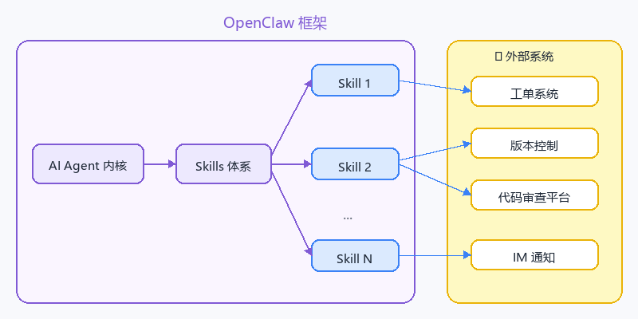
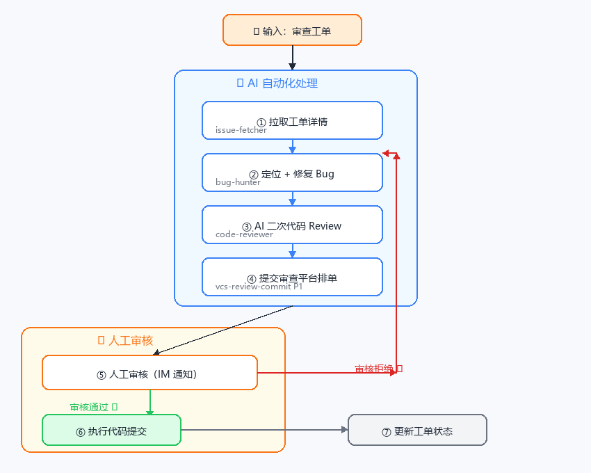
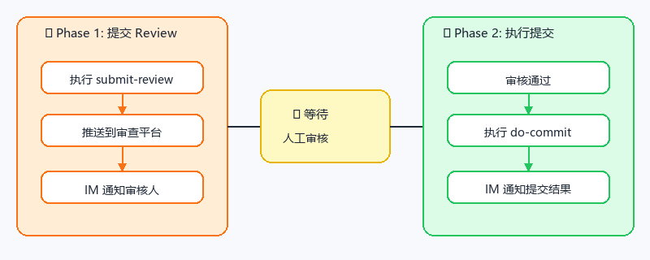
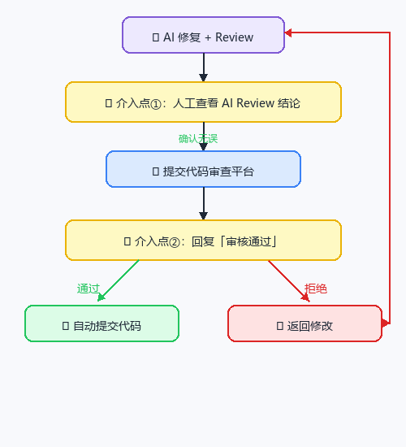
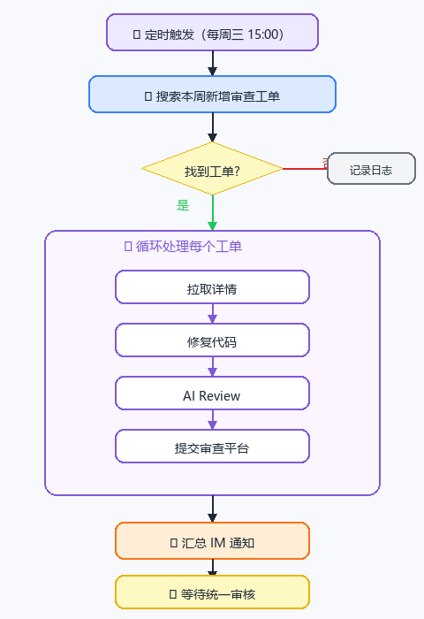

# 🤖 OpenClaw 落地应用实践（二）：一名24小时修Bug的数字伙伴

> 将重复性代码修复工作交给 AI，把时间留给更有价值的事情。

> 🎯 **适用场景**：服务端代码审查类 Bug 自动修复（工单系统 + 版本控制 + 代码审查平台）

---

## 一、概述

### 1.1 什么是 OpenClaw？

**OpenClaw** 是一个 AI Agent 运行时框架，其核心设计理念是 **Skills 体系**：



- **Skill**：一个专注于特定任务的能力模块，封装了工具调用、流程编排、领域知识
- **可组合**：多个 Skill 可以串联、并联，形成复杂的自动化工作流
- **可复用**：一个 Skill 可以在不同项目、不同场景中复用

本文以 **代码审查工单自动修复** 为案例，展示如何利用 OpenClaw 的 Skills 体系，将 4 个专用 Skill 串联成一个完整的自动化流程。

---

## 二、背景

### 2.1 问题现状

每周服务端都会收到一批来自 **代码审查平台** 的工单，内容是代码审查机器人发现的安全隐患：

| 问题类型 | 具体表现 | 风险等级 |
|----------|----------|----------|
| `ConsumeItem` 返回值未检查 | 扣物品可能失败但逻辑继续执行 | 🔴 高 |
| RPC 参数未做合法性校验 | 未校验类型、范围、枚举值等 | 🔴 高 |
| 操作原子性问题 | 多步操作中途失败未回滚 | 🟡 中 |

> 💡 由于平台进行了一次性扫描，发现了非常多的历史遗留问题（总数超 100 个），这类 Bug **数量多、规律强、重复度高**，人工处理费时费力，但是非常适合用 AI 做自动化处理。

### 2.2 解决方案

经过几轮打磨，整理出了一套 **「拉工单 → 修代码 → AI Review → 提交审核 → 代码提交」** 的全流程自动化方案。

---

## 三、整体流程概览

整个流程涉及 **4 个 AI Skill**，分工明确，每步都有明确的输入/输出：



**流程总览**：

```
┌─────────────────┐    ┌─────────────────┐    ┌─────────────────┐    ┌─────────────────┐
│  issue-fetcher   │ →  │   bug-hunter     │ →  │  code-reviewer   │ →  │vcs-review-commit│
│  ① 工单拉取      │    │  ② Bug 修复      │    │  ③ AI二次Review  │    │  ④ 两阶段提交    │
└─────────────────┘    └─────────────────┘    └─────────────────┘    └─────────────────┘
```

---

## 四、四个核心 Skill 详解

### 4.1 Skill ①：issue-fetcher — 工单拉取

| 属性 | 说明 |
|------|------|
| **🎯 作用** | 从工单系统搜索并拉取工单详情，格式化为结构化信息供后续步骤使用 |
| **📋 典型用法** | • 搜索指派给自己的全部代码审查工单<br>• 按工单 ID 拉取单条详情（函数名、文件路径、Review URL 等） |

**操作步骤**：

1. 配置工单系统 API Token
2. 调用 `issue-fetcher` Skill
3. 获取工单列表或单条工单详情

**输出格式**：结构化的工单信息，包含函数名、文件路径、Review URL 等关键字段。

---

### 4.2 Skill ②：bug-hunter — Bug 修复

| 属性 | 说明 |
|------|------|
| **🎯 作用** | 根据工单描述定位代码，理解 Bug 本质，应用安全修复模式 |

#### 覆盖的典型 Bug 类型

| Bug 类型 | 风险描述 | 修复方式 |
|----------|----------|----------|
| 🔴 `ConsumeItem` 返回值未检查 | 扣物品失败仍发奖励，被刷 | 检查返回值，失败时 `return` |
| 🔴 RPC 参数未校验 | 非法参数导致逻辑错误甚至崩服 | 在函数入口加参数合法性检查 |
| 🟡 操作原子性问题 | 中途失败导致数据不一致 | 先检查再操作，或增加回滚逻辑 |

> ⚠️ **编码警告**：根据项目实际情况，注意源代码文件的编码格式（如 GBK/UTF-8），AI 读写文件时必须保持编码一致，否则可能导致中文乱码。

#### 修复前后对比示例

**❌ 修复前：没有检查返回值**

```lua
local function SubmitHalloweenCandy2014(role, args)
    ConsumeItem(role, ITEM_CANDY, args.count)
    GiveReward(role, REWARD_ID)  -- 万一扣失败，奖励照给！
end
```

**✅ 修复后：检查返回值，失败直接返回**

```lua
local function SubmitHalloweenCandy2014(role, args)
    local ok = ConsumeItem(role, ITEM_CANDY, args.count)
    if not ok then
        return  -- 扣物品失败，终止逻辑
    end
    GiveReward(role, REWARD_ID)
end
```

---

### 4.3 Skill ③：ai-code-reviewer — AI 二次 Review

| 属性 | 说明 |
|------|------|
| **🎯 作用** | 对 AI 修改过的代码做二次质量把关 |
| **🔍 检查维度** | • **逻辑正确性**：修复是否解决了问题，有没有引入新 Bug<br>• **安全性**：边界条件、异常分支<br>• **性能**：有无不必要的开销<br>• **规范符合性**：命名、注释、代码风格 |

> 💡 **为什么需要二次 Review？**
> AI 修代码可能引入微妙的错误，特别是在不熟悉上下文的情况下。让 AI 自己 Review 自己的改动，能捕获大部分低级错误，降低人工审查负担。

---

### 4.4 Skill ④：vcs-review-commit — 两阶段提交

| 属性 | 说明 |
|------|------|
| **🎯 作用** | 与代码审查平台集成，实现「先审后提」的安全提交流程 |



#### Phase 1：提交 Review 排单

```bash
vcs-review-commit submit-review \
    --files src/modules/activity/activity_handler.lua \
    --message "fix #12345 【代码审查】..."
```

执行后：
- ✅ 代码被推送到审查平台排单
- ✅ AI 通过 IM 发通知，附上 `review_url`
- ⏳ **等待人工审核通过**

#### Phase 2：执行 SVN Commit

用户回复「审核通过」后，AI 自动执行：

```bash
vcs-review-commit do-commit \
    --review-id <Phase1 保存的 review-id> \
    --files src/modules/activity/activity_handler.lua \
    --message "fix #12345 ..."
```

> 🔴 **Commit Message 格式规范**
>
> ```
> fix #12345 【代码审查】HandleActivitySubmit 未检查 ConsumeItem 返回值
> fix #12346 【代码审查】AnotherFunction 参数未校验
> 本次是AI自动提交，请务必仔细检查
> ```
>
> ⚠️ `fix #工单号` **必须在第一行**！版本控制系统的 pre-commit hook 通常要求首行匹配工单号格式（如 `fix #12345`），否则提交会被拦截。

---

## 五、人工介入点

整个流程 **并非完全无人值守**，设计了两个关键的人工介入点以确保安全：



### 为什么保留人工节点？

| 原因 | 说明 |
|------|------|
| 🛡️ **安全兜底** | AI 修复可能存在上下文理解偏差，人工兜底更安全 |
| 📋 **流程要求** | Review 平台本身要求人工背书 |
| ⚖️ **风险控制** | 对于批量自动化操作，多一道确认能显著降低风险 |

**介入点说明**：

1. **Review 审核**：AI 提交代码到审查平台后，需要人工审核代码改动
2. **Commit 确认**：人工审核通过后，回复"审核通过"，AI 才会执行代码提交

---

## 六、自动化调度（Cron）

这套流程可以配置为 **每周定时自动触发**（例如每周三下午 3 点），AI 会自动执行全流程：



**一次处理多个工单时，Commit Message 会自动合并**：

```
fix #12345 【代码审查】...
fix #12346 【代码审查】...
fix #12347 【代码审查】...
本次是AI自动提交，请务必仔细检查
```

---

## 七、适用条件与局限

| ✅ 适合 AI 自动化的情况 | ⚠️ 需要人工介入的情况 |
|------------------------|----------------------|
| Bug 模式明确、重复度高（如 ConsumeItem 返回值检查） | Bug 描述模糊，需要理解业务背景 |
| 文件路径和涉及函数在工单中已明确标注 | 涉及跨文件逻辑改动 |
| 修改范围小、局部性强，不影响其他逻辑 | 需要添加新的状态字段或改动数据结构 |
| — | 函数逻辑复杂，AI 理解可能有偏差 |

---

## 八、收益总结

| 指标 | 原流程（纯手工） | 自动化后 | 提升 |
|------|----------------|----------|------|
| 单个工单处理时间 | 10~20 分钟 | < 2 分钟 | **⬆️ 5~10x** |
| 人工操作步骤 | 全程手工 | 只需审核 + 一句「审核通过」 | **⬇️ 90%** |
| 漏检风险 | 人工容易遗漏 | AI 逐条处理，不漏单 | **⬇️ 显著** |
| 编码规范一致性 | 依赖个人习惯 | 统一模式，强制 Review | **⬆️ 统一** |

---

## 九、如何复用这套方案

### 9.1 为什么选择 OpenClaw？

相比于单纯编写脚本或使用通用 AI 工具，使用 OpenClaw 的优势在于：

| 对比项 | 传统脚本 | 通用 AI 工具 | OpenClaw Skills |
|--------|---------|-------------|----------------|
| 领域知识封装 | ❌ 需要硬编码 | ⚠️ 每次重新描述 | ✅ Skill 内置 |
| 流程可组合性 | ⚠️ 需要重写 | ❌ 无法复用 | ✅ Skill 串联 |
| 人工介入点 | ⚠️ 需要自行设计 | ❌ 难以控制 | ✅ 框架支持 |
| 错误处理 | ⚠️ 需要大量代码 | ⚠️ 不可控 | ✅ Skill 内置 |
| 可迁移性 | ❌ 项目绑定 | ⚠️ 依赖 Prompt | ✅ Skill 复用 |


### 9.2 快速开始步骤

1. **阅读前序文章**：[《OpenClaw 落地应用实践（一）》](./getting-started-practice.md) 了解 OpenClaw 基础架构
2. **搭建本地环境**：按照第一篇文章的指引，在本地安装 OpenClaw
3. **定义你的 Skills**：针对你的业务场景，设计专用的 Skill
4. **组合工作流**：将多个 Skill 串联成自动化流程

> 💡 如果你的项目也有类似的 **「批量、规律、重复」** 代码修复场景，可以参考本方案进行复用或改造。

### 9.3 Skill 制作方法

> 所有 Skill 都是使用 `skill-creator` 这个 Skill 来制作的：
>
> - `issue-fetcher`：基于工单系统的 API 文档 + AI 编写
> - `bug-hunter`：基于项目的代码知识（AI 总结 + 人工添加）
> - `code-reviewer`：在 bug-hunter 的基础上做的强化审查功能
> - `vcs-review-commit`：根据代码审查平台的接口 API，设计成两步提交（和人工提交代码流程一致）

---

## 十、系列文章导航

| 篇目 | 主题 | 链接 |
|------|------|------|
| 第一篇 | OpenClaw 落地应用实践（一） | [查看](./getting-started-practice.md) |
| **第二篇** | **🤖 一名24小时修Bug的数字伙伴（本文）** | — |
| 第三篇 | 🔍 一名24小时在线的运营数据挖掘工程师 | 待补充 |
| 第四篇 | 🎯 多Agent三方沙盘会 | [查看](./multi-agent-sandbox-meeting.md) |
| 第五篇 | AI抛锅AI背——从文案审查到自动修复的闭环之路 | 待补充 |
| 第六篇 | 面向策划的程序顾问 Agent | 待补充 |

---

## 参考资料

- [OpenClaw GitHub 仓库](https://github.com/nicepkg/openclaw)
