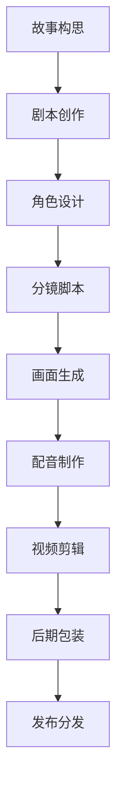

# AI漫剧制作完整工作流

> 从故事构思到成品发布，用AI打造你的专属漫剧

## 🎬 什么是AI漫剧？

AI漫剧是利用人工智能技术制作的动画短剧，结合了：
- **📝 AI编剧**：智能故事创作和剧本生成
- **🎨 AI绘画**：角色设计和场景绘制
- **🎵 AI配音**：语音合成和音效制作
- **🎞️ AI剪辑**：自动化视频编辑和特效

## 🚀 制作工作流概览



## 📝 第一步：故事构思与剧本创作

### 1.1 故事主题确定

> **"导师，我想制作一个AI漫剧，但不知道从哪里开始构思故事？"**小李问道。
>
> **"哈哈，小李，故事创作就像盖房子，得先有个好地基！"**我回答说，**"让AI帮你brainstorm一些有趣的主题吧。"**

```python
# 使用AI生成故事创意
import openai

def generate_story_ideas(genre, target_audience, duration):
    prompt = f"""
    请为我生成3个{genre}类型的短剧创意，面向{target_audience}观众，
    单集时长约{duration}分钟。每个创意包含：
    1. 核心概念（一句话概括）
    2. 主要角色设定
    3. 基本剧情框架
    4. 独特卖点
    
    要求：新颖有趣，适合AI制作，视觉效果丰富
    """
    
    response = openai.ChatCompletion.create(
        model="gpt-4",
        messages=[{"role": "user", "content": prompt}]
    )
    
    return response.choices[0].message.content

# 示例：生成科幻喜剧创意
ideas = generate_story_ideas("科幻喜剧", "年轻人", 5)
print(ideas)
```

**输出示例**：
```
创意1：《AI室友日记》
- 核心概念：一个程序员意外激活了家里的智能家居AI，AI有了自主意识后想要体验人类生活
- 主要角色：宅男程序员小王、调皮的AI助手小A、邻居小美
- 剧情框架：AI学习人类情感→制造搞笑意外→最终成为好朋友
- 独特卖点：AI视角看人类世界，科技与温情并存

创意2：《时间管理局》
...
```

### 1.2 详细剧本撰写

```python
def write_episode_script(story_concept, episode_number):
    prompt = f"""
    基于故事概念：{story_concept}
    
    请为第{episode_number}集撰写详细剧本，包含：
    
    1. 场景设置：
       - 时间：
       - 地点：
       - 环境描述：
    
    2. 角色登场：
       - 主要角色状态
       - 情绪和动机
    
    3. 对话内容：
       - 自然流畅的对话
       - 符合角色性格
       - 包含笑点或冲突点
    
    4. 动作描述：
       - 角色动作
       - 场景变化
       - 特效需求
    
    5. 情节转折：
       - 起承转合结构
       - 悬念设置
       - 结尾hooks
    
    总字数：800-1200字
    风格：轻松幽默，节奏明快
    """
    
    response = openai.ChatCompletion.create(
        model="gpt-4",
        messages=[{"role": "user", "content": prompt}]
    )
    
    return response.choices[0].message.content
```

## 🎨 第二步：角色设计

### 2.1 角色概念设计

```python
def design_character(character_description, art_style):
    prompt = f"""
    角色描述：{character_description}
    艺术风格：{art_style}
    
    请生成角色设计提示词，包含：
    1. 外观特征：年龄、身高、体型、发型、服装
    2. 色彩搭配：主色调、辅助色、特色元素
    3. 表情特点：眼神、微表情、标志性动作
    4. 道具配饰：随身物品、装饰元素
    5. 画风要求：线条风格、渲染效果、细节程度
    
    格式要求：适合Midjourney/Stable Diffusion使用
    """
    
    response = openai.ChatCompletion.create(
        model="gpt-4",
        messages=[{"role": "user", "content": prompt}]
    )
    
    return response.choices[0].message.content

# 示例：设计AI助手角色
character_prompt = design_character(
    "调皮可爱的AI助手，拟人化形象，科技感与萌系结合",
    "现代卡通风格，色彩明亮"
)

print(character_prompt)
```

### 2.2 角色图像生成

```python
# 使用Stable Diffusion生成角色图像
import requests

def generate_character_image(prompt, style="anime"):
    api_url = "https://api.stability.ai/v1/generation/stable-diffusion-xl-1024-v1-0/text-to-image"
    
    data = {
        "text_prompts": [
            {
                "text": f"{prompt}, {style} style, high quality, detailed, character sheet, multiple angles",
                "weight": 1
            },
            {
                "text": "blurry, low quality, distorted",
                "weight": -1
            }
        ],
        "cfg_scale": 7,
        "height": 1024,
        "width": 1024,
        "samples": 4,
        "steps": 30,
    }
    
    headers = {
        "Accept": "application/json",
        "Authorization": f"Bearer {STABILITY_API_KEY}",
        "Content-Type": "application/json",
    }
    
    response = requests.post(api_url, headers=headers, json=data)
    
    return response.json()

# 生成角色设定图
character_images = generate_character_image(
    "cute AI assistant character, holographic appearance, blue and white color scheme, friendly expression, floating beside a computer"
)
```

### 2.3 角色表情包制作

```python
def create_emotion_set(base_character_prompt):
    emotions = [
        "happy and excited",
        "confused and puzzled", 
        "angry and frustrated",
        "sad and disappointed",
        "surprised and shocked",
        "thinking and contemplative"
    ]
    
    emotion_images = {}
    
    for emotion in emotions:
        full_prompt = f"{base_character_prompt}, {emotion} expression, close-up portrait"
        images = generate_character_image(full_prompt)
        emotion_images[emotion] = images
        
    return emotion_images
```

## 🎬 第三步：分镜脚本制作

### 3.1 自动分镜生成

```python
def create_storyboard(script):
    prompt = f"""
    根据以下剧本内容，创建详细分镜脚本：
    
    剧本：
    {script}
    
    请按以下格式输出每个镜头：
    
    镜头X：
    - 画面描述：[详细的视觉描述，包括角色位置、动作、场景元素]
    - 镜头类型：[特写/中景/全景/航拍等]
    - 运镜方式：[固定/推拉/摇移/跟随等] 
    - 时长：[预估秒数]
    - 对话/旁白：[此镜头的声音内容]
    - 音效：[需要的音效]
    - 特效：[特殊效果需求]
    
    要求：
    - 每个镜头3-8秒
    - 注重视觉节奏
    - 突出重点情节
    - 考虑AI制作的可行性
    """
    
    response = openai.ChatCompletion.create(
        model="gpt-4",
        messages=[{"role": "user", "content": prompt}],
        max_tokens=2000
    )
    
    return response.choices[0].message.content
```

### 3.2 镜头画面提示词生成

```python
def generate_shot_prompts(storyboard):
    shots = parse_storyboard(storyboard)  # 解析分镜脚本
    
    shot_prompts = []
    
    for i, shot in enumerate(shots):
        prompt = f"""
        镜头{i+1} - {shot['type']}镜头：
        {shot['description']}
        
        艺术风格：动画风格，明亮色彩，高质量渲染
        技术要求：16:9比例，1920x1080分辨率，适合动画制作
        
        关键要素：
        - 角色：{shot.get('characters', '')}
        - 场景：{shot.get('scene', '')}
        - 情绪：{shot.get('mood', '')}
        - 特效：{shot.get('effects', '')}
        
        Prompt: [角色描述], [场景描述], [情绪氛围], [艺术风格], high quality, detailed, anime style, 16:9 aspect ratio
        """
        
        shot_prompts.append(prompt)
    
    return shot_prompts
```

## 🖼️ 第四步：画面生成

### 4.1 场景背景制作

```python
def generate_backgrounds(scene_descriptions):
    backgrounds = {}
    
    for scene_name, description in scene_descriptions.items():
        prompt = f"""
        {description}, 
        detailed background illustration, 
        no characters, 
        anime style environment, 
        high resolution, 
        suitable for animation,
        16:9 aspect ratio,
        vibrant colors
        """
        
        background_image = generate_character_image(prompt, "environment art")
        backgrounds[scene_name] = background_image
    
    return backgrounds

# 示例场景
scenes = {
    "living_room": "modern apartment living room, cozy atmosphere, large window with city view, smart home devices visible",
    "kitchen": "contemporary kitchen, clean and bright, smart appliances, breakfast table setup",
    "computer_room": "programmer's workspace, multiple monitors, RGB lighting, tech gadgets, slightly messy but organized"
}

backgrounds = generate_backgrounds(scenes)
```

### 4.2 角色动作序列生成

```python
def generate_action_sequence(character_prompt, action_description, frames=8):
    """生成角色动作序列帧"""
    
    action_frames = []
    
    for frame in range(frames):
        frame_prompt = f"""
        {character_prompt},
        {action_description},
        frame {frame+1} of {frames},
        smooth animation sequence,
        consistent character design,
        anime style,
        high quality
        """
        
        frame_image = generate_character_image(frame_prompt)
        action_frames.append(frame_image)
    
    return action_frames

# 示例：生成"AI角色思考"动作序列
thinking_sequence = generate_action_sequence(
    "cute AI assistant character, blue holographic appearance",
    "thinking gesture, hand on chin, contemplative expression, slight head tilt",
    frames=6
)
```

## 🎵 第五步：配音与音效制作

### 5.1 AI语音合成

```python
import edge_tts
import asyncio

async def generate_voice(text, voice="zh-CN-XiaoyiNeural", rate="+0%", pitch="+0Hz"):
    """使用Edge TTS生成语音"""
    
    communicate = edge_tts.Communicate(text, voice)
    await communicate.save("output_voice.wav")
    
    return "output_voice.wav"

# 角色语音配置
voice_config = {
    "小王": "zh-CN-YunxiNeural",  # 男性声音
    "小A": "zh-CN-XiaoyiNeural",   # 女性声音，稍微调高音调表现AI特色
    "小美": "zh-CN-XiaohanNeural"  # 女性声音
}

async def generate_episode_audio(script_with_dialogue):
    audio_files = []
    
    for dialogue in script_with_dialogue:
        character = dialogue['character']
        text = dialogue['text']
        voice = voice_config.get(character, "zh-CN-XiaoyiNeural")
        
        # 为AI角色添加特殊音效
        if character == "小A":
            # 稍微提高音调，模拟AI声音
            audio_file = await generate_voice(
                text, 
                voice=voice, 
                pitch="+50Hz",
                rate="+5%"
            )
        else:
            audio_file = await generate_voice(text, voice=voice)
        
        audio_files.append({
            'character': character,
            'file': audio_file,
            'timestamp': dialogue['timestamp']
        })
    
    return audio_files
```

### 5.2 背景音乐生成

```python
def generate_background_music(scene_mood, duration=30):
    """使用AI音乐生成工具创建背景音乐"""
    
    prompt = f"""
    Create a {duration}-second background music track for an anime scene.
    Mood: {scene_mood}
    Style: Light, cheerful, anime-style background music
    Instruments: Synthesizer, light percussion, soft melody
    Tempo: Moderate
    No vocals, instrumental only
    """
    
    # 这里可以集成Suno AI或其他音乐生成API
    # music_file = suno_ai.generate(prompt)
    
    return f"bgm_{scene_mood}.mp3"

# 为不同场景生成背景音乐
bgm_tracks = {
    "comedy": generate_background_music("playful and humorous", 30),
    "heartwarming": generate_background_music("warm and emotional", 25),
    "tech": generate_background_music("modern and tech-inspired", 35)
}
```

## 🎞️ 第六步：视频剪辑与合成

### 6.1 自动化视频剪辑

```python
from moviepy.editor import *
import json

def create_animation_video(shots_data, audio_files, bgm_tracks):
    """
    自动合成动画视频
    """
    
    video_clips = []
    current_time = 0
    
    for i, shot in enumerate(shots_data):
        # 加载镜头图像
        shot_image = shot['image_path']
        duration = shot['duration']
        
        # 创建图像剪辑
        img_clip = ImageClip(shot_image, duration=duration)
        
        # 添加动画效果
        if shot.get('animation_type') == 'zoom_in':
            img_clip = img_clip.resize(lambda t: 1 + 0.02*t)
        elif shot.get('animation_type') == 'pan_left':
            img_clip = img_clip.set_position(lambda t: (-50*t, 0))
        
        # 设置时间轴位置
        img_clip = img_clip.set_start(current_time)
        video_clips.append(img_clip)
        
        current_time += duration
    
    # 合成主视频
    main_video = CompositeVideoClip(video_clips)
    
    # 添加音频轨道
    audio_clips = []
    
    # 添加对话音频
    for audio in audio_files:
        audio_clip = AudioFileClip(audio['file'])
        audio_clip = audio_clip.set_start(audio['timestamp'])
        audio_clips.append(audio_clip)
    
    # 添加背景音乐
    bgm = AudioFileClip(bgm_tracks['comedy'])
    bgm = bgm.volumex(0.3)  # 降低背景音乐音量
    audio_clips.append(bgm)
    
    # 合成音频
    final_audio = CompositeAudioClip(audio_clips)
    
    # 组合视频和音频
    final_video = main_video.set_audio(final_audio)
    
    return final_video

def add_subtitles(video, dialogue_data):
    """添加字幕"""
    subtitle_clips = []
    
    for dialogue in dialogue_data:
        txt_clip = TextClip(
            dialogue['text'],
            fontsize=24,
            color='white',
            font='Arial-Bold',
            stroke_color='black',
            stroke_width=2
        )
        
        txt_clip = txt_clip.set_position(('center', 'bottom')).set_duration(
            dialogue['duration']
        ).set_start(dialogue['start_time'])
        
        subtitle_clips.append(txt_clip)
    
    return CompositeVideoClip([video] + subtitle_clips)
```

### 6.2 特效与后期处理

```python
def add_special_effects(video):
    """添加特殊效果"""
    
    # AI全息效果
    def ai_hologram_effect(get_frame, t):
        frame = get_frame(t)
        # 添加蓝色色调和透明度变化
        if t % 2 < 0.1:  # 每2秒闪烁一次
            frame = frame * [0.8, 0.9, 1.2]  # 蓝色调
        return frame
    
    # 科技风格转场效果
    def tech_transition(clip, duration=0.5):
        # 添加像素化转场效果
        def pixelate(get_frame, t):
            if t < duration:
                # 逐渐去像素化
                factor = int(20 * (1 - t/duration)) + 1
                frame = get_frame(t)
                h, w = frame.shape[:2]
                frame = frame[::factor, ::factor]
                frame = np.repeat(np.repeat(frame, factor, axis=0), factor, axis=1)
                return frame[:h, :w]
            return get_frame(t)
        
        return clip.fl(pixelate)
    
    # 应用效果
    enhanced_video = video.fl(ai_hologram_effect)
    
    return enhanced_video
```

## 📤 第七步：后期包装与发布

### 7.1 片头片尾制作

```python
def create_opening_title(title, duration=3):
    """创建片头"""
    
    # 标题文字
    title_clip = TextClip(
        title,
        fontsize=48,
        color='white',
        font='Arial-Bold'
    ).set_position('center').set_duration(duration)
    
    # 背景
    bg_color = ColorClip(size=(1920, 1080), color=(0, 10, 30), duration=duration)
    
    # 添加动画效果
    title_clip = title_clip.crossfadein(0.5).crossfadeout(0.5)
    
    return CompositeVideoClip([bg_color, title_clip])

def create_end_credits(credits_text, duration=4):
    """创建片尾"""
    
    credits_clip = TextClip(
        credits_text,
        fontsize=20,
        color='white',
        font='Arial'
    ).set_position('center').set_duration(duration)
    
    bg_color = ColorClip(size=(1920, 1080), color=(20, 20, 20), duration=duration)
    
    return CompositeVideoClip([bg_color, credits_clip])
```

### 7.2 完整制作流程整合

```python
class AIComicProduction:
    def __init__(self):
        self.project_config = {}
        self.assets = {}
    
    def create_full_episode(self, story_concept, episode_number):
        """完整制作流程"""
        
        print("🎬 开始制作AI漫剧...")
        
        # 1. 生成剧本
        print("📝 生成剧本...")
        script = write_episode_script(story_concept, episode_number)
        
        # 2. 创建分镜
        print("🎬 创建分镜...")
        storyboard = create_storyboard(script)
        
        # 3. 生成角色和场景
        print("🎨 生成视觉素材...")
        characters = self.generate_characters()
        backgrounds = self.generate_backgrounds()
        
        # 4. 制作配音
        print("🎵 生成配音...")
        audio_files = await generate_episode_audio(script)
        bgm = generate_background_music("comedy")
        
        # 5. 视频合成
        print("🎞️ 合成视频...")
        video = create_animation_video(storyboard, audio_files, bgm)
        
        # 6. 添加特效
        print("✨ 添加特效...")
        video = add_special_effects(video)
        video = add_subtitles(video, script)
        
        # 7. 添加片头片尾
        print("📺 添加片头片尾...")
        opening = create_opening_title(f"AI室友日记 第{episode_number}集")
        ending = create_end_credits("制作：AI创作工作室\n感谢观看！")
        
        final_video = concatenate_videoclips([opening, video, ending])
        
        # 8. 导出视频
        output_path = f"ai_comic_episode_{episode_number}.mp4"
        final_video.write_videofile(
            output_path,
            fps=24,
            codec='libx264',
            audio_codec='aac'
        )
        
        print(f"✅ 制作完成！文件保存至：{output_path}")
        
        return output_path

# 使用示例
producer = AIComicProduction()
episode_path = producer.create_full_episode("AI室友日记", 1)
```

## 📊 制作成本与时间

| 制作环节 | 时间消耗 | 成本估算 | 主要工具 |
|---------|---------|---------|---------|
| 故事创作 | 1-2小时 | $5-10 | GPT-4 |
| 角色设计 | 2-3小时 | $10-20 | Midjourney/SD |
| 分镜制作 | 1-2小时 | $3-8 | GPT-4 |
| 画面生成 | 3-4小时 | $20-40 | Stable Diffusion |
| 配音制作 | 1小时 | 免费 | Edge TTS |
| 视频剪辑 | 2-3小时 | 免费 | MoviePy |
| **总计** | **10-15小时** | **$38-78** | |

## 🎯 质量提升建议

### 1. 视觉一致性
- 建立角色设计规范，确保每个镜头中角色形象一致
- 使用相同的艺术风格提示词
- 建立色彩搭配指南

### 2. 剧情节奏
- 控制每个镜头的时长，保持节奏感
- 在对话间添加适当停顿
- 注意情节的起承转合

### 3. 音效协调
- 背景音乐音量不要盖过对话
- 为不同角色使用不同的配音风格
- 添加环境音效增强真实感

## 🚀 进阶技巧

### 1. 批量制作
```python
def batch_production(story_concepts, total_episodes):
    """批量制作多集内容"""
    for concept in story_concepts:
        for episode in range(1, total_episodes + 1):
            producer = AIComicProduction()
            producer.create_full_episode(concept, episode)
            print(f"完成 {concept} 第{episode}集")
```

### 2. 用户反馈集成
```python
def incorporate_feedback(previous_episode, user_comments):
    """根据用户反馈优化后续创作"""
    prompt = f"""
    基于上一集内容：{previous_episode}
    用户反馈：{user_comments}
    
    请为下一集制作提供改进建议：
    1. 剧情方向调整
    2. 角色发展建议  
    3. 画面风格优化
    4. 节奏把控要点
    """
    
    suggestions = openai.ChatCompletion.create(
        model="gpt-4",
        messages=[{"role": "user", "content": prompt}]
    )
    
    return suggestions.choices[0].message.content
```

## 📈 分发与推广

### 1. 平台发布
- **B站**：适合动漫内容，用户活跃度高
- **抖音/快手**：短视频平台，传播速度快
- **微博**：配合话题营销
- **YouTube**：国际化推广

### 2. SEO优化
```python
def generate_seo_content(episode_summary):
    """为视频生成SEO优化的标题、描述、标签"""
    
    prompt = f"""
    视频内容简介：{episode_summary}
    
    请生成以下SEO内容：
    
    1. 吸引人的标题（包含关键词"AI漫剧"）
    2. 详细视频描述（150-300字）
    3. 相关标签（10-15个）
    4. 缩略图文案建议
    
    要求：符合平台算法偏好，提高曝光率
    """
    
    seo_content = openai.ChatCompletion.create(
        model="gpt-4",
        messages=[{"role": "user", "content": prompt}]
    )
    
    return seo_content.choices[0].message.content
```

## 💡 创作建议

1. **保持原创性**：即使使用AI工具，也要注入个人创意和想法
2. **注重互动性**：鼓励观众参与故事创作，提供选择分支
3. **建立IP价值**：打造有记忆点的角色和世界观
4. **持续优化**：根据数据反馈不断改进制作流程
5. **法律合规**：注意版权问题，使用合规的AI工具和素材

---

*AI漫剧制作是技术与创意的完美结合，用AI作为创作工具，让更多人能够实现自己的动画梦想！* 🎬✨